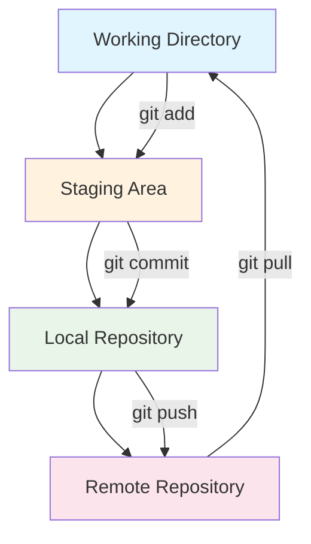
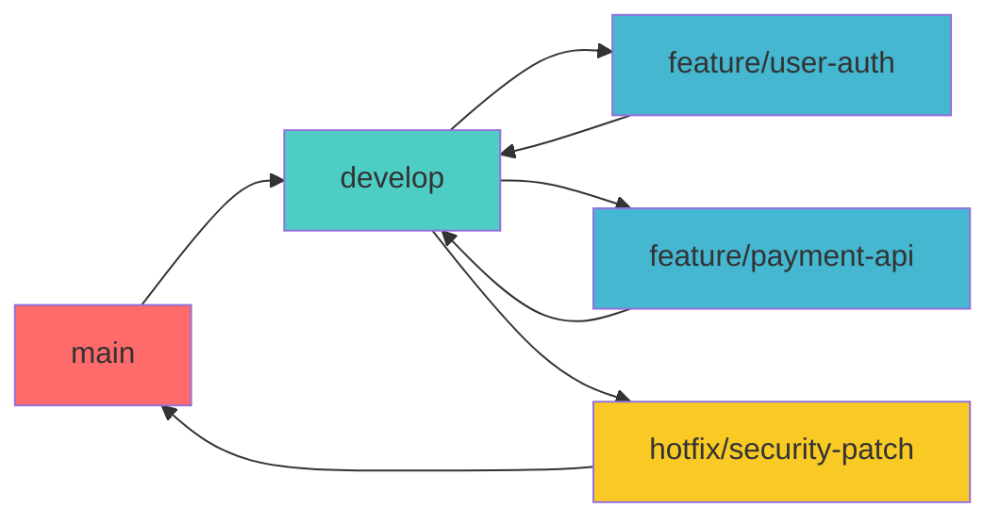
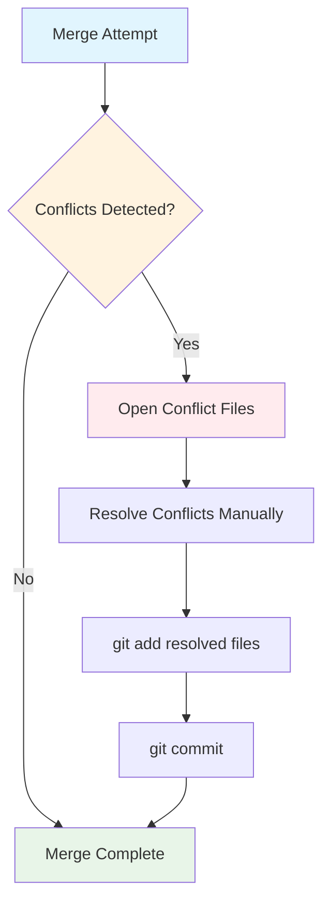
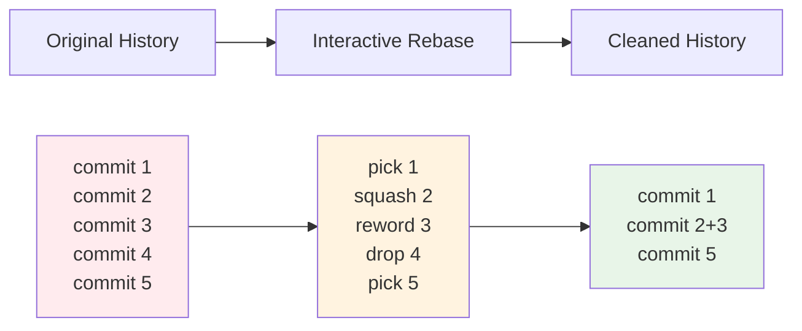
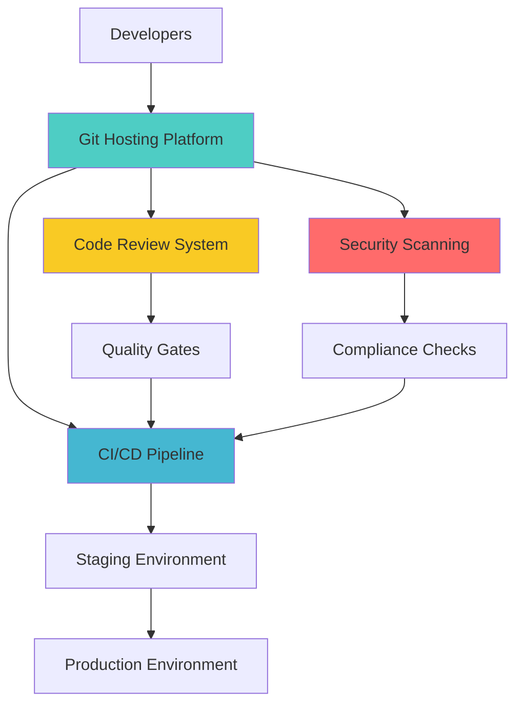
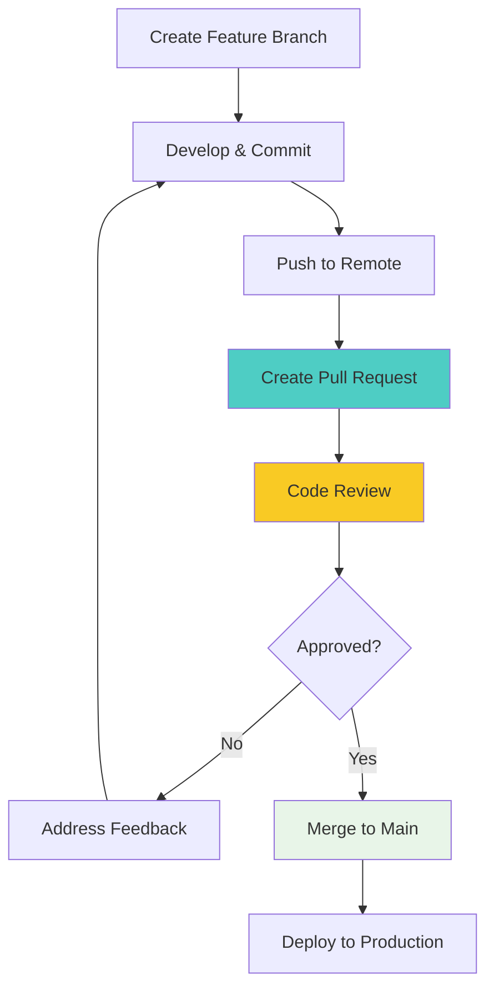

# Git Mastery: The Complete Professional Guide
## From Foundation to Advanced Enterprise Workflows

---

### Executive Summary

Git is the cornerstone of modern software development, powering collaboration for millions of developers worldwide. This comprehensive guide provides structured learning paths for professionals at all levels, from newcomers establishing foundational knowledge to senior engineers implementing complex enterprise workflows.

**Target Audience:** Software developers, DevOps engineers, technical leads, and engineering managers seeking to master distributed version control systems.

---

## Table of Contents

1. [Strategic Overview](#strategic-overview)
2. [Foundation & Setup](#foundation--setup)
3. [Core Development Workflows](#core-development-workflows)
4. [Advanced Engineering Techniques](#advanced-engineering-techniques)
5. [Enterprise Integration Patterns](#enterprise-integration-patterns)
6. [Performance Optimization](#performance-optimization)
7. [Security & Compliance](#security--compliance)
8. [Best Practices & Standards](#best-practices--standards)

---

## Strategic Overview

### Why Git Dominates Version Control

Git's distributed architecture provides several critical advantages for modern software development:

**Technical Benefits:**
- **Distributed Architecture:** Every clone contains the complete repository history
- **Performance Excellence:** Optimized for speed with local operations
- **Data Integrity:** Cryptographic hashing ensures content authenticity
- **Flexible Branching:** Lightweight branches enable parallel development strategies

**Business Value:**
- **Risk Mitigation:** Complete version history prevents data loss
- **Team Scalability:** Supports teams from 1 to 1000+ developers
- **Integration Ecosystem:** Seamless CI/CD pipeline integration
- **Open Source Foundation:** Vendor-neutral with extensive tooling support

### Git Architecture Overview



---

## Foundation & Setup

### Professional Installation & Configuration

#### System Installation

**Windows (Recommended: Git for Windows)**
```powershell
# Via Chocolatey
choco install git

# Via Winget
winget install --id Git.Git -e --source winget
```

**macOS (Recommended: Homebrew)**
```bash
# Install via Homebrew
brew install git

# Verify installation
git --version
```

**Linux (Ubuntu/Debian)**
```bash
# Update package index
sudo apt update

# Install Git
sudo apt install git-all

# Verify installation
git --version
```

#### Professional Configuration Setup

```bash
# Essential identity configuration
git config --global user.name "Your Professional Name"
git config --global user.email "your.email@company.com"

# Enhanced editor and diff tools
git config --global core.editor "code --wait"  # VS Code
git config --global merge.tool "vimdiff"

# Performance optimizations
git config --global core.preloadindex true
git config --global core.fscache true
git config --global gc.auto 256

# Security enhancements
git config --global commit.gpgsign true
git config --global tag.gpgsign true

# Professional aliases for efficiency
git config --global alias.co checkout
git config --global alias.br branch
git config --global alias.ci commit
git config --global alias.st status
git config --global alias.unstage 'reset HEAD --'
git config --global alias.last 'log -1 HEAD'
git config --global alias.visual '!gitk'
git config --global alias.graph 'log --oneline --graph --decorate --all'
```

### Repository Initialization Patterns

#### New Project Setup
```bash
# Initialize repository with best practices
mkdir my-professional-project
cd my-professional-project
git init
echo "# Professional Project" > README.md
echo "node_modules/" > .gitignore
echo ".env" >> .gitignore
git add .
git commit -m "feat: initialize project structure"
```

#### Cloning Existing Repositories
```bash
# Clone with specific branch
git clone -b develop https://github.com/company/project.git

# Clone with depth limit for large repositories
git clone --depth 1 https://github.com/company/project.git

# Clone with submodules
git clone --recurse-submodules https://github.com/company/project.git
```

---

## Core Development Workflows

### Professional Branching Strategy



#### Git Flow Implementation

**Feature Development Workflow:**
```bash
# Start feature development
git checkout develop
git pull origin develop
git checkout -b feature/user-authentication

# Development cycle
git add .
git commit -m "feat: implement user login functionality"

# Regular synchronization
git checkout develop
git pull origin develop
git checkout feature/user-authentication
git merge develop

# Complete feature
git checkout develop
git merge --no-ff feature/user-authentication
git branch -d feature/user-authentication
git push origin develop
```

**Hotfix Workflow:**
```bash
# Critical production fix
git checkout main
git pull origin main
git checkout -b hotfix/security-vulnerability

# Apply fix
git add .
git commit -m "fix: resolve critical security vulnerability"

# Deploy to production
git checkout main
git merge --no-ff hotfix/security-vulnerability
git tag -a v1.0.1 -m "Security patch release"
git push origin main --tags

# Backport to develop
git checkout develop
git merge hotfix/security-vulnerability
git push origin develop
```

### Advanced Merging Strategies

#### Merge Conflict Resolution Workflow



**Professional Conflict Resolution:**
```bash
# Identify conflicts
git status

# Use merge tools
git mergetool

# Manual resolution markers
<<<<<<< HEAD
// Current branch changes
=======
// Incoming branch changes
>>>>>>> feature-branch

# After resolution
git add resolved-file.js
git commit -m "resolve: merge conflicts in user authentication"
```

### Commit Message Standards

#### Conventional Commits Specification

```bash
# Format: <type>(<scope>): <description>
#
# Types: feat, fix, docs, style, refactor, test, chore
# Scope: optional, indicates component/module affected

# Examples:
git commit -m "feat(auth): implement OAuth2 integration"
git commit -m "fix(api): resolve user data validation error"
git commit -m "docs(readme): update installation instructions"
git commit -m "refactor(utils): optimize data processing functions"
```

---

## Advanced Engineering Techniques

### Interactive Rebase Mastery

#### Commit History Optimization

```bash
# Interactive rebase for last 5 commits
git rebase -i HEAD~5

# Rebase options in editor:
# pick = use commit
# reword = use commit, edit message
# edit = use commit, stop for amending
# squash = use commit, meld into previous
# fixup = like squash, discard message
# drop = remove commit
```

**Professional Rebase Workflow:**



### Git Bisect for Bug Investigation

#### Automated Bug Detection

```bash
# Start bisection process
git bisect start

# Mark current state as bad
git bisect bad

# Mark known good commit
git bisect good v2.0.0

# Automated testing with script
git bisect run ./test-script.sh

# Manual testing process
# Test current commit...
git bisect good  # if test passes
git bisect bad   # if test fails

# Complete investigation
git bisect reset
```

### Advanced History Manipulation

#### Repository Archaeology

```bash
# Find commits that modified specific function
git log -p --follow -S "function_name"

# Show commits by author in date range
git log --author="John Doe" --since="2024-01-01" --until="2024-12-31"

# Find commits that introduced/removed text
git log --grep="bug fix" --all

# Blame analysis with ignored revisions
git blame --ignore-revs-file .git-blame-ignore-revs file.js

# Advanced search in commit content
git log --all --full-history -- path/to/deleted/file.js
```

---

## Enterprise Integration Patterns

### Git Server Architecture



### Submodules for Microservices

#### Managing Multi-Repository Dependencies

```bash
# Add submodule
git submodule add https://github.com/company/shared-lib.git libs/shared

# Clone with submodules
git clone --recurse-submodules https://github.com/company/main-project.git

# Update submodules
git submodule update --remote --merge

# Remove submodule
git submodule deinit -f libs/shared
git rm -f libs/shared
rm -rf .git/modules/libs/shared
```

### Git Hooks for Automation

#### Pre-commit Quality Enforcement

```bash
#!/bin/sh
# .git/hooks/pre-commit

# Run linting
npm run lint
if [ $? -ne 0 ]; then
    echo "Linting failed. Commit aborted."
    exit 1
fi

# Run tests
npm test
if [ $? -ne 0 ]; then
    echo "Tests failed. Commit aborted."
    exit 1
fi

# Check commit message format
commit_regex='^(feat|fix|docs|style|refactor|test|chore)(\(.+\))?: .{1,50}'
if ! grep -qE "$commit_regex" "$1"; then
    echo "Invalid commit message format. Please use conventional commits."
    exit 1
fi
```

---

## Performance Optimization

### Repository Optimization Techniques

#### Large Repository Management

```bash
# Repository cleanup
git gc --aggressive --prune=now

# Optimize pack files
git repack -ad

# Remove unreferenced objects
git prune --expire=now

# Reduce repository size
git filter-repo --strip-blobs-bigger-than 10M

# Enable partial clone for large repositories
git clone --filter=blob:none <url>
```

### Git LFS Integration

#### Large File Storage Configuration

```bash
# Install Git LFS
git lfs install

# Track large file types
git lfs track "*.psd"
git lfs track "*.zip"
git lfs track "*.mp4"

# Commit LFS configuration
git add .gitattributes
git commit -m "chore: configure Git LFS for large files"

# Push LFS files
git lfs push origin main --all
```

---

## Security & Compliance

### GPG Commit Signing

#### Cryptographic Verification Setup

```bash
# Generate GPG key
gpg --gen-key

# List GPG keys
gpg --list-secret-keys --keyid-format LONG

# Configure Git to use GPG key
git config --global user.signingkey YOUR_GPG_KEY_ID
git config --global commit.gpgsign true

# Verify signed commits
git log --show-signature
```

### Access Control Patterns

#### Branch Protection Rules

```bash
# Server-side hook for branch protection
#!/bin/sh
# pre-receive hook

protected_branch='refs/heads/main'
if [ "$ref" = "$protected_branch" ]; then
    echo "Direct pushes to main branch are prohibited"
    echo "Please create a pull request instead"
    exit 1
fi
```

---

## Best Practices & Standards

### Code Review Workflow



### Professional Git Workflow Checklist

#### Daily Development Routine

- [ ] Start day with `git pull origin main`
- [ ] Create feature branch with descriptive name
- [ ] Make atomic commits with clear messages
- [ ] Run tests before committing
- [ ] Push regularly to backup work
- [ ] Create pull requests for code review
- [ ] Squash commits before merging
- [ ] Delete merged feature branches

#### Weekly Repository Maintenance

- [ ] Review and clean up local branches
- [ ] Update Git configuration if needed
- [ ] Check repository size and optimize if necessary
- [ ] Review and update .gitignore files
- [ ] Validate backup and disaster recovery procedures

### Troubleshooting Guide

#### Common Issues & Solutions

**Detached HEAD State:**
```bash
# Check current status
git status

# Create branch from current state
git checkout -b recovery-branch

# Or discard changes and return to branch
git checkout main
```

**Lost Commits Recovery:**
```bash
# Find lost commits
git reflog

# Recover specific commit
git cherry-pick COMMIT_HASH

# Reset to previous state
git reset --hard HEAD@{2}
```

**Large File Issues:**
```bash
# Remove large file from history
git filter-repo --path-glob '*.large-file' --invert-paths

# Clean up repository
git gc --aggressive --prune=now
```

---

## Conclusion

Mastering Git is essential for professional software development. This guide provides the foundation and advanced techniques needed to leverage Git effectively in modern development environments. Regular practice and continuous learning will enhance your version control expertise and contribute to more efficient, reliable software development processes.

### Additional Resources

- **Official Documentation:** [git-scm.com/doc](https://git-scm.com/doc)
- **Pro Git Book:** [git-scm.com/book](https://git-scm.com/book)
- **Interactive Learning:** [learngitbranching.js.org](https://learngitbranching.js.org)
- **Git Flow Extension:** [github.com/nvie/gitflow](https://github.com/nvie/gitflow)

### Contributing to This Guide

Welcome contributions to improve this professional Git guide. Please follow our contribution guidelines:

1. Fork the repository
2. Create a feature branch: `git checkout -b feature/enhancement-name`
3. Follow conventional commit messages
4. Submit a pull request with detailed description
5. Ensure all examples are tested and accurate

---

*Last Updated: August 2025 | Version 2.0*
